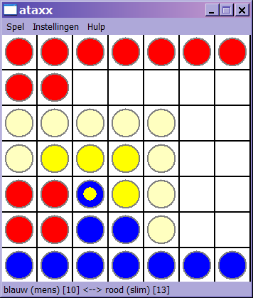

# Ataxx

For a introductory C++ programming course at [LIACS](https://liacs.leidenuniv.nl/), I had to make a simple game of Ataxx. The game is in Dutch. First I made a console (CLI) version, and then I used the [Ultimate++](https://www.ultimatepp.org/) framework to add a GUI.

The computer opponent is rather dull because my coding isn't that smart, but you might be interested in the UPP (Ultimate Plus Plus or U++) framework. Then it was still allowed to choose your own GUI libraries and I really liked it for a small app. In later years, the supervising professor (Walter Kosters, one of the best teachers I've had) decided to standardise on Qt.

